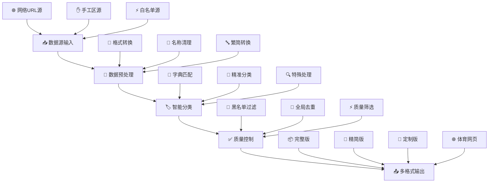

📺 直播源聚合处理工具 v2.00

🎯 项目概述

一个功能完整的直播源处理系统，专门用于从多个网络源收集、整理、分类和去重电视直播频道数据，生成多种格式的输出文件供播放器使用。该系统支持50+个精准分类，具备智能名称处理、多重质量控制、多格式输出等高级功能。

✨ 核心特性

🌐 多源聚合

· 支持从多个网络源自动获取直播数据
· 动态日期变量处理（如 {MMdd}、{MMdd-1}）
· 智能格式识别（M3U/TXT自动转换）
· 支持HTTP重试机制和指数退避算法

🧠 智能分类

· 基于频道名称的智能分类系统
· 支持50+个精准分类（央视、卫视、地方台、港澳台等）
· 繁体转简体自动处理
· 频道名称标准化和纠错

🛡️ 质量管控

· 四级去重机制（URL哈希、分类内、黑名单、协议过滤）
· 黑白名单双重管理系统
· 基于响应时间的源质量筛选
· 手工区高质量源保障

📤 多格式输出

· 完整版、精简版、定制版三种输出
· TXT和M3U格式双输出
· 自动集成频道Logo和EPG信息
· 体育赛事独立网页版输出

🏗️ 系统架构



📁 目录结构

输入目录结构

```
scripts/livesource/
├── 📂 assets/
│   ├── 📂 livesource/
│   │   ├── 📂 blacklist/              # 🚫 黑名单管理系统
│   │   │   ├── blacklist_auto.txt     # 🤖 自动收集的无效URL
│   │   │   ├── blacklist_manual.txt   # 👨‍💻 手工维护的永久黑名单
│   │   │   └── whitelist_auto.txt     # ⚡ 高速响应源白名单
│   │   ├── 📂 主频道/                 # 📺 主要频道分类字典
│   │   │   ├── 央视.txt              # 🏛️ 央视频道标准名称
│   │   │   ├── 卫视.txt              # 📡 卫视频道标准名称
│   │   │   ├── 新闻.txt              # 📰 新闻类频道
│   │   │   ├── 电影.txt              # 🎬 电影类频道
│   │   │   └── ... (23个分类)
│   │   ├── 📂 地方台/                 # 🗺️ 地方频道字典
│   │   │   ├── 北京.txt
│   │   │   ├── 上海.txt
│   │   │   ├── 广东.txt
│   │   │   └── ... (27个省份)
│   │   ├── 📂 手工区/                 # ✋ 手工维护的高质量源
│   │   │   ├── 港澳台.txt
│   │   │   ├── 优质央视.txt
│   │   │   ├── AKTV.txt
│   │   │   └── 今日推荐.txt
│   │   ├── 📄 logo.txt               # 🖼️ 台标映射
│   │   ├── 📄 urls-daily.txt         # 📅 每日更新的源URL列表
│   │   └── 📄 corrections_name.txt   # 🔧 频道别名修正
└── 🐍 livesource.py                  # 🎯 主处理脚本
```

输出目录结构

```
output/
├── 📺 full.txt               # 📦 完整版：所有分类
├── 📺 full.m3u               # 🎵 完整版M3U格式
├── 🎯 lite.txt               # 🚀 精简版：主要频道
├── 🎯 lite.m3u               # 🎵 精简版M3U格式
├── ⚙️ custom.txt             # 🎨 定制版：精选频道
├── ⚙️ custom.m3u             # 🎵 定制版M3U格式
├── 📦 others.txt             # 🔍 其他未分类频道
└── ⚽ tiyu.html              # 🌐 体育赛事网页版
├── ⚽ tiyu.txt               # 📄 体育赛事文本版
```

🚀 快速开始

系统要求

· Python 3.6 或更高版本
· 以下Python库：
  ```
  pip install opencc
  ```

运行步骤

1. 克隆或下载项目
   ```bash
   git clone [项目地址]
   cd [项目目录]
   ```
2. 准备配置文件
   · 确保 assets/livesource/ 目录结构完整
   · 检查 urls-daily.txt 包含有效的直播源URL
   · 根据需要更新分类字典文件
3. 运行主脚本
   ```bash
   python livesource.py
   ```
4. 获取输出文件
   · 完整版：output/full.txt 和 output/full.m3u
   · 精简版：output/lite.txt 和 output/lite.m3u
   · 定制版：output/custom.txt 和 output/custom.m3u
   · 体育赛事：output/tiyu.html 和 output/tiyu.txt

⚙️ 配置详解

1. 源URL配置 (urls-daily.txt)

· 每行一个直播源URL
· 支持日期变量：{MMdd}（当月当天）、{MMdd-1}（前一天）
· 支持M3U、TXT等多种格式

2. 分类字典配置

· 主频道分类：23个分类，如央视、卫视、电影、体育等
· 地方台分类：27个省份，覆盖全国各地区
· 定制分类：包括港澳台、数字频道、戏曲频道等

3. 黑名单系统

· 自动黑名单：从处理过程中自动收集的无效URL
· 手动黑名单：人工维护的永久无效源
· 合并处理：自动和手动黑名单合并去重

4. 白名单优化

· 基于响应时间的质量筛选（<2000ms）
· 高速源自动收录和优先处理

🔧 核心功能详解

1. 智能名称处理

```python
def process_channel_line(line):
    # 频道名称清理
    # 繁简转换
    # 名称纠错
    # 智能分类
```

处理流程：

1. 清理冗余标识（_电信、高清、HD等）
2. 繁体转简体
3. 应用名称纠错字典
4. 基于字典的智能分类

2. 多级去重机制

1. 全局URL去重：使用集合记录所有已处理URL
2. 黑名单过滤：过滤已知无效URL
3. 分类内去重：每个分类内部去重
4. 协议过滤：跳过不稳定协议（tvbus://、/udp/等）

3. 质量控制系统

· 响应时间筛选：优先选择高速响应的源
· 手工区保障：手动维护的高质量源
· AKTV特殊处理：专门处理AKTV直播源

4. 体育赛事处理

· 日期标准化：统一日期格式为MM-DD
· 关键词过滤：过滤无效内容
· 网页生成：生成可直接访问的HTML页面

📊 输出文件说明

完整版 (full.txt, full.m3u)

· 包含内容：所有50+个分类的完整频道列表
· 适用场景：需要全面频道覆盖的专业用户
· 文件特点：
  · 详细分类，结构清晰
  · 包含完整的更新信息
  · 集成频道Logo和EPG信息（M3U格式）

精简版 (lite.txt, lite.m3u)

· 包含内容：仅央视和卫视等主要频道
· 适用场景：追求加载速度和简洁界面的普通用户
· 文件特点：
  · 文件体积小，加载迅速
  · 核心内容完整
  · 包含基本更新信息

定制版 (custom.txt, custom.m3u)

· 包含内容：主要频道 + 精选分类 + 动态更新
· 适用场景：平衡全面性和文件大小的进阶用户
· 文件特点：
  · 既有主要频道，又有实用分类
  · 包含实用的更新和推荐信息
  · 适合日常使用

体育赛事 (tiyu.html, tiyu.txt)

· 包含内容：最新的体育赛事直播源
· 适用场景：体育爱好者
· 文件特点：
  · HTML页面可直接访问
  · 支持一键复制链接
  · 日期倒序排列，最新赛事在前

🎯 使用场景

个人家庭使用

· 智能电视/电视盒子：使用M3U格式导入直播软件
· 手机/平板：支持IPTV播放器应用
· 电脑播放：VLC、PotPlayer等播放器

机构/企业使用

· 酒店电视系统：提供稳定的频道源
· 校园电视台：教育直播平台
· 企业内部直播：企业文化和培训直播

开发者/研究者

· 直播源质量分析：源稳定性、响应时间研究
· 播放器开发测试：兼容性测试
· 内容聚合平台：多源内容聚合

📈 性能统计

脚本执行过程中会输出详细的统计信息：

```
📊 去重统计信息:
   处理的唯一URL数: 1234
   黑名单URL数: 156
   总处理URL数: 1390
   🔄 去重率: 11.2%

📋 黑名单统计信息:
   自动维护: 120 条
   手动维护: 36 条
   合并去重: 156 条

📺 频道统计:
   央视: 45 个
   卫视: 32 个
   地方台: 567 个
   其他分类: 890 个

⏱️ 执行时间: 2分15秒
```

🔄 自动化部署

定时任务（Linux/Mac）

```bash
# 编辑crontab
crontab -e

# 每天凌晨2点执行
0 2 * * * cd /path/to/project && python livesource.py
```

Windows计划任务

1. 创建批处理文件 run_livesource.bat
2. 使用任务计划程序设置每日执行

⚠️ 注意事项

法律合规

· 请确保使用的直播源符合当地法律法规
· 尊重内容版权，合法使用直播内容
· 商业使用时请确保合规性

时效性管理

· 直播源具有时效性，建议每日更新
· 定期维护URL源列表
· 关注分类字典的更新

资源优化

· 处理大量数据时注意内存使用
· 合理设置网络超时参数
· 定期清理旧的输出文件

🛠️ 故障排除

常见问题

1. 网络连接失败
   · 检查网络连接
   · 调整超时时间和重试次数
   · 验证URL源的有效性
2. 内存不足
   · 减少同时处理的URL数量
   · 增加系统内存
   · 优化分类字典大小
3. 输出文件为空
   · 检查URL源是否有效
   · 验证分类字典格式
   · 查看黑名单配置

调试方法

· 启用详细日志输出
· 分步测试每个处理阶段
· 使用小规模数据测试

📝 更新日志

v2.00 (当前版本)

· ✅ 新增全局URL去重机制
· ✅ 优化黑名单管理系统
· ✅ 添加详细的统计信息
· ✅ 改进体育赛事处理
· ✅ 增强错误处理和日志输出

v1.xx (历史版本)

· 初始版本功能
· 基础分类系统
· 多格式输出支持

🤝 贡献指南

欢迎贡献代码、报告问题或提出改进建议：

1. 报告问题：在Issues中描述问题
2. 提交改进：创建Pull Request
3. 更新字典：改进分类字典和频道名称

📄 许可证

本项目基于MIT许可证开源。详见LICENSE文件。

📞 支持与联系

如有问题或建议，请通过以下方式联系：

· 项目Issue页面
· 邮箱：[项目维护者邮箱]
· 文档Wiki：[项目Wiki地址]

---

提示：这个脚本是一个功能完整、设计专业的直播源处理系统，适合需要高质量电视直播频道管理的各种应用场景。通过合理的配置和维护，可以提供稳定可靠的直播源服务。