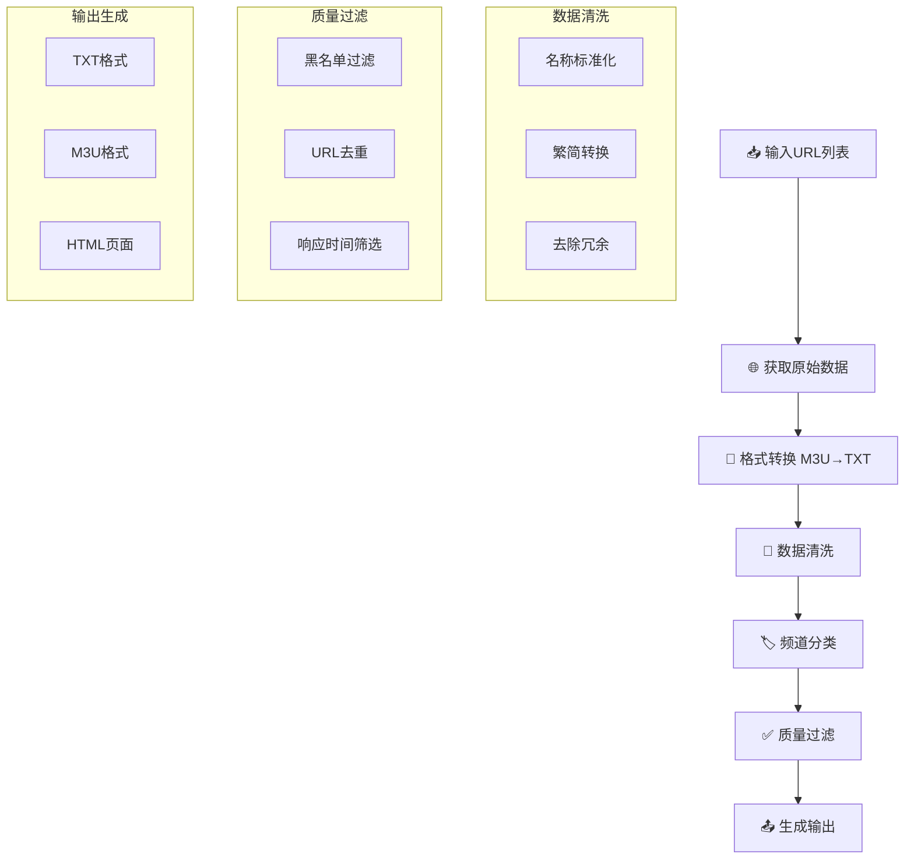

📺 直播源聚合处理工具 v1.00

🌟 项目简介

一个功能强大的直播源自动化处理系统，能够从多个网络源收集、整理、分类和去重电视直播频道数据，生成多种格式的输出文件供各种播放器使用。

🎯 核心特性

⚡ 智能处理能力

· 多源聚合：从多个网络源自动采集直播数据
· 智能分类：基于频道名称自动分类到50+个精准分类
· 多重去重：四级去重机制确保数据纯净
· 质量过滤：黑白名单结合的质量控制系统

🎨 多格式输出

· 完整版：包含所有分类的完整频道列表
· 精简版：仅包含核心频道，加载速度快
· 定制版：平衡全面性和文件大小
· M3U格式：兼容主流播放器，集成Logo和EPG
· 网页版：体育赛事专用网页界面

🛡️ 稳定可靠

· 错误恢复：智能重试和错误处理机制
· 质量控制：响应时间筛选和手工源保障
· 时间同步：北京时间标准化处理
· 实时监控：详细的处理日志和统计信息

📋 系统要求

· Python版本: 3.6 或更高版本
· 操作系统: Windows / Linux / macOS
· 网络连接: 稳定的互联网连接
· 存储空间: 至少100MB可用空间

📁 项目结构

```
项目目录/
├── 📂 assets/livesource/        # 资源文件目录
│   ├── 📂 主频道/              # 主要频道分类字典 (23个分类)
│   ├── 📂 地方台/              # 省级地方台字典 (27个省份)
│   ├── 📂 手工区/              # 高质量手工源
│   ├── 📂 blacklist/           # 黑白名单管理系统
│   ├── 📄 logo.txt            # 台标映射文件
│   ├── 📄 urls-daily.txt      # 每日更新的源URL列表
│   └── 📄 corrections_name.txt # 频道名称纠错
├── 📂 output/                  # 输出文件目录 (自动创建)
│   ├── 📄 full.txt            # 完整版频道列表
│   ├── 📄 lite.txt            # 精简版频道列表
│   ├── 📄 custom.txt          # 定制版频道列表
│   ├── 📄 others.txt          # 未分类频道
│   ├── 🎵 *.m3u               # M3U格式文件
│   └── 🌐 tiyu.html           # 体育赛事网页版
└── 🐍 livesource.py           # 主处理脚本
```

🚀 快速开始

1. 安装依赖

```bash
pip install opencc
```

2. 配置数据源

编辑 assets/livesource/urls-daily.txt 文件，添加你的直播源URL：

```
# 格式：一行一个URL
http://example.com/live.m3u
http://example.com/live.txt
```

3. 运行脚本

```bash
python livesource.py
```

4. 查看输出

处理完成后，所有输出文件将在 output/ 目录中生成。

⚙️ 配置文件说明

频道分类字典

· 位置: assets/livesource/主频道/ 和 assets/livesource/地方台/
· 格式: 每行一个频道名称，用于分类匹配
· 更新: 可根据需要添加新的分类或频道

黑白名单管理

· 黑名单: assets/livesource/blacklist/blacklist_*.txt
  · blacklist_auto.txt: 自动收集的无效URL
  · blacklist_manual.txt: 手工维护的永久黑名单
· 白名单: assets/livesource/blacklist/whitelist_auto.txt
  · 高速响应源（<2秒）自动收录

手工区源

· 位置: assets/livesource/手工区/
· 内容: 高质量、稳定的手工维护直播源
· 特点: 按地区/分类组织，定期更新

🔧 核心功能详解

数据处理流程



四级去重机制

1. URL哈希去重 - 使用MD5确保同一URL不被重复收录
2. 分类内去重 - 每个分类内部进行URL存在性检查
3. 黑名单过滤 - 过滤已知无效、过期或恶意URL
4. 协议过滤 - 跳过不稳定协议（tvbus://、/udp/等）

智能分类系统

支持 50+ 个精准分类：

分类类型 数量 说明
主频道 2个 央视、卫视
地方台 27个 各省市自治区
专业频道 23个 电影、体育、新闻等
港澳台 3个 香港、澳门、闽南
其他 3个 数字、收藏、其他

📊 输出文件说明

1. full.txt (完整版)

· 内容: 所有50+个分类的完整频道列表
· 大小: 约15KB-50KB
· 适用: 需要全面频道覆盖的专业用户
· 特点: 分类详细，包含完整的更新信息和推荐频道

2. lite.txt (精简版)

· 内容: 仅包含央视和卫视等主要频道
· 大小: 约3KB-10KB
· 适用: 追求加载速度和简洁界面的普通用户
· 特点: 文件体积小，加载迅速，核心内容完整

3. custom.txt (定制版)

· 内容: 主要频道 + 动态更新信息 + 精选分类
· 大小: 约5KB-20KB
· 适用: 平衡全面性和文件大小的进阶用户
· 特点: 既有主要频道，又包含实用的更新和推荐信息

4. M3U格式文件

· 兼容性: 支持VLC、PotPlayer、Kodi等主流播放器
· 特性: 自动集成Logo、EPG信息、分组管理
· 生成: 自动从TXT格式转换生成

5. tiyu.html (体育赛事网页版)

· 格式: 响应式HTML页面
· 功能: 一键复制直播链接，移动端友好
· 内容: 过滤后的体育赛事直播源

🔄 自动化部署

Linux/Mac定时任务

使用crontab设置每日自动更新：

```bash
# 编辑crontab
crontab -e

# 添加以下行（每天凌晨2点执行）
0 2 * * * cd /path/to/your/project && python3 livesource.py
```

Windows计划任务

1. 打开"任务计划程序"
2. 创建基本任务
3. 设置每日执行时间
4. 程序选择: python.exe
5. 参数: livesource.py
6. 起始于: 项目目录路径

🐛 故障排除

常见问题

1. Python依赖错误
   ```bash
   # 安装缺少的依赖
   pip install opencc
   ```
2. 网络连接问题
   · 检查防火墙设置
   · 确保代理配置正确
   · 验证URL源是否可访问
3. 文件权限问题
   ```bash
   # Linux/Mac
   chmod +x livesource.py
   chmod -R 755 assets/
   ```
4. 内存不足
   · 减少urls-daily.txt中的URL数量
   · 增加系统虚拟内存
   · 使用精简版输出

日志解读

```
✅ 完整版播放列表已保存: output/full.txt
✅ 精简版播放列表已保存: output/lite.txt
✅ 定制版播放列表已保存：output/custom.txt
✅ 未分类频道列表已保存: output/others.txt
📊 去重统计信息:
   处理的唯一URL数: 1245
   黑名单URL数: 156
   总处理URL数: 1401
   🔄 去重率: 11.1%
```

· 去重率高：说明源质量好，重复内容少
· 黑名单过滤多：可能源中有大量无效链接
· 处理时间过长：检查网络连接或减少URL数量

📈 性能优化建议

1. 源质量优化

· 定期清理urls-daily.txt，移除失效URL
· 添加高质量、稳定的源到手工区
· 使用白名单机制保留高速源

2. 处理速度优化

· 调整REQUEST_TIMEOUT参数（默认10秒）
· 减少重试次数REQUEST_RETRIES（默认3次）
· 使用CDN加速的源

3. 内存使用优化

· 处理大量数据时，分批处理URL
· 定期清理output/目录中的旧文件
· 使用精简版输出减少内存占用

🔮 未来计划

计划功能

· Web界面配置和管理
· API接口支持
· 多语言支持
· Docker容器化部署
· 实时监控仪表盘

优化方向

· 机器学习智能分类
· 自动源质量评估
· 分布式处理支持
· 更智能的去重算法

🤝 贡献指南

提交问题

1. 确认问题未被报告
2. 提供详细的错误信息
3. 附上相关的日志输出
4. 描述重现步骤

提交代码

1. Fork项目仓库
2. 创建功能分支
3. 提交清晰的提交信息
4. 创建Pull Request

添加新源

1. 测试源的稳定性和质量
2. 添加到合适的分类
3. 更新相关文档
4. 提交Pull Request

📄 许可证

本项目采用 MIT 许可证。详细信息请参阅 LICENSE 文件。

🙏 致谢

感谢所有为项目贡献代码、提供反馈和分享直播源的用户。

📞 支持与反馈

· 问题报告: GitHub Issues
· 功能建议: GitHub Discussions
· 紧急联系: 项目维护者邮箱

---

注意: 本项目仅用于技术研究和学习目的。使用者应遵守当地法律法规，尊重内容版权，合法使用直播内容。